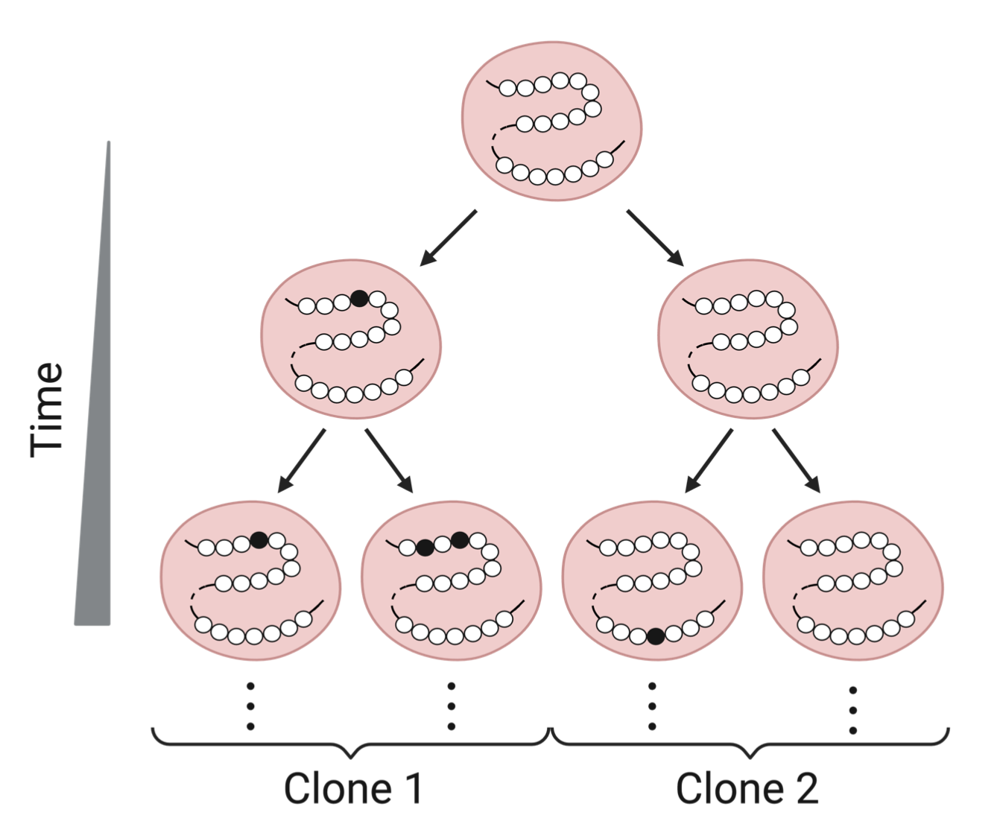
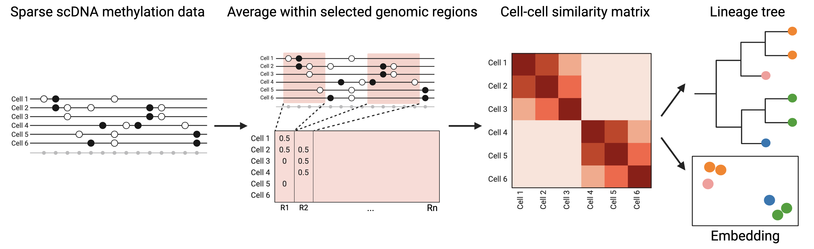
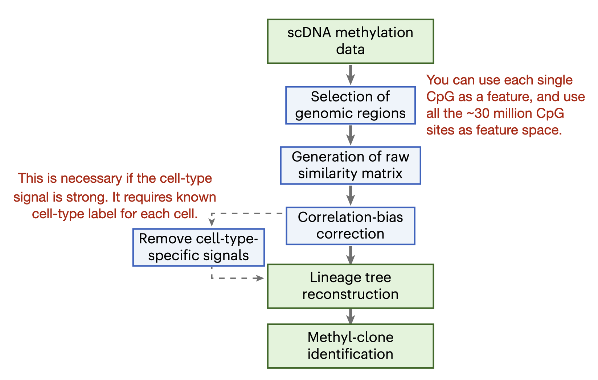
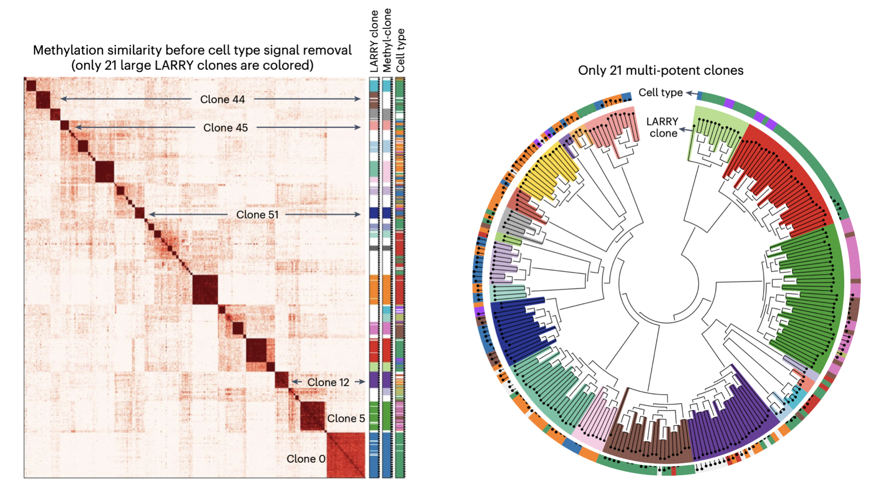

# MethylTree: High-resolution, noninvasive single-cell lineage tracing based on DNA methylation EPImutations

<p align="center">
  
</p>

MethylTree utilizes frequent yet stable EPImutations on sparse single-cell DNA methylation profiles to build a lineage tree that reflects cell division histories. This approach is highly accurate and does not require genetic manipulation for the cells of interest, thus applicable to human tissues. This is based on our recent manuscript ([Chen & Fu et.al., Nature Methods, 2025](https://www.nature.com/articles/s41592-024-02567-1)).




## Installation
Please setup a conda environment called `MethylTree`. This is our core environment
```bash
conda create -n MethylTree python=3.9 --yes
conda activate MethylTree
pip install methyltree
pip install methscan
pip install jupyterlab
python -m ipykernel install --user --name=MethylTree
```

## MethylTree workflow



## Representative results


## MethylTree Analysis with preprocessed toy data
The usage of MethylTree is illustrated in the test module `test/MethylTree`. There, the [MethylTree notebook](https://github.com/ShouWenWang-Lab/MethylTree/blob/master/test/MethylTree.ipynb) can be executed directly on the test dataset. The test data is a subset of the DARLIN dataset (Li et.al., Cell, 2023). This notebook offers a detailed tutorial of the key functionalities of MethylTree, including lineage tree reconstruction, visualization, result characterization, embedding, clone inference etc. Please use the `MethylTree` environment.


## MethylTree Analysis starting from raw CpG files
Once the raw CpG files for each cell are generated using mapping softwares like Bismark, you can first follow the [preprocessing notebook](https://github.com/ShouWenWang-Lab/MethylTree_notebooks/blob/main/mouse_LK_only_quality_checking.ipynb) and then the [downstream analysis notebook](https://github.com/ShouWenWang-Lab/MethylTree_notebooks/blob/main/mouse_LK_downstream_analysis.ipynb) to get the lineage inference results from MethylTree. For more information, please visit our [notebook repository](https://github.com/ShouWenWang-Lab/MethylTree_notebooks) that reproduce all analysis in our MethylTree paper. Raw data can be obtained from either [figshare](https://figshare.com/articles/dataset/High-resolution_noninvasive_single-cell_lineage_tracing_in_mice_and_humans_based_on_DNA_methylation_EPImutations/27265212?file=49943949) or [GEO database](https://www.ncbi.nlm.nih.gov/geo/query/acc.cgi?acc=GSE262580).


## Additional information

More detailed information for the explanation of MethylTree input and output can be found at [here](https://github.com/ShouWenWang-Lab/methyltree_docs).

## MethylTree Analysis with EPI-Clone Datasets (_Last updated: September 29, 2025_)

We provide [a notebook](https://github.com/ShouWenWang-Lab/MethylTree_notebooks/tree/main/Using_MethylTree_to_analyze_EPI-Clone_datasets) that applies **MethylTree** to analyze the transplanted mouse dataset *LARRY_mouse1* from the EPI-Clone study.
